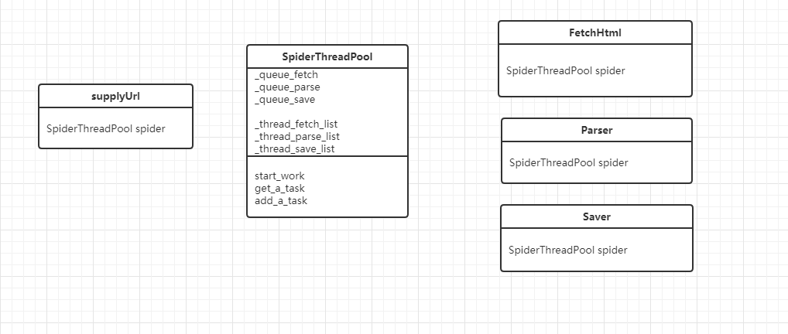

python_taptap_spider
=====================

爬取taptap 网站的给类别游戏

#### 设计思路  



- 编写类supplyUrl提供url，fetchHtml获取html，parser解析html，saver保存item
- 用spiderThreadPool 来管理fetchHtml,parser,saver 线程，线程之间spiderThreadPool 的成员变量 queue 来通信。如，supplyUrl把url 写入`queue_fetch`，fetchHtml 从`queue_fetch`获取url，并将html 页面写入 `queue_parse` ，parser从`queue_parse` 获取html，将item写入到`queue_save`.....
- 注意每一个通过`put()`方法进入队列的元素都有 `task_done()`，比如针对队列`queue_fetch`，fetchHtm从中取出一个url,并把根据该url 获取的html 写入到队列`queue_parse` 则给元素url 的任务完成，消费者调用`queue_fetch`的task_done方法
- 同时可在 spiderTheadPool 的成员变量来记录三个队列里面的元素的个数，操作count时加上互斥锁。
- 在spiderTheadPool 编写，`add_a_task()`，`get_a_task()`，`finish_a_task()`这些方法实现往队列里面加task
- 涉及的常量可以采用枚举类型

#### spiderGame 项目结构
```
|-- spiderGame
|-- spiderGame
    |-- concurrent
        |-- __init__.py
        |-- spiderThreadPool.py
    |-- instances
        |-- __init__.py
        |-- fetchHtml.py
        |-- parser.py
        |-- saver.py
    |-- utils
        |-- __init__.py
        |-- constantEnum.py
        |-- supplyUrl.py
        |-- fetch_parse_save.txt
    |-- __init__.py
|-- test_spidreGame.py
```

#### 遇到问题
- 如何控制各个线程在task全部完成之后，有序停下。设置启动的线程的守护进程为主线程，启动supplyUrl 线程后，让主线程tiem.sleep(5)，把一些url写到`queue_fetch`，再利用队列，`queue_fetch.join`、`queue_parse.join()`、`queue_save.join()`。意思是，`queue_fetch,..`队列元素全部`task_done()`，主线程才能结束，注意队列.join() 的顺序有关系。
```
def test():
   spider = tapSpider()
   supplyurl = SupplyUrl("supplyUrl-thread-01", spider)
   # 启动supplyurl，spider里面的线程
   supplyurl.setDaemon(True)
   supplyurl.start()
   # 给supplyurl线程一些时间，往queue_fecth写数据
   time.sleep(10)
   # 启动 fetch parser saver 三个线程
   spider.start_work()
   # join 想通过三个队列queue join()来控制线程的结束
   spider.wait_finish() # 方法内部写的 队列.join()
```